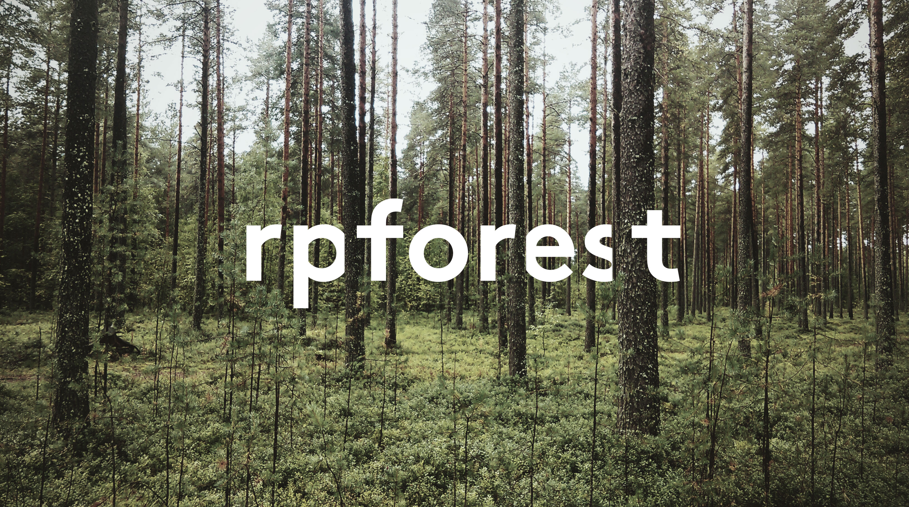
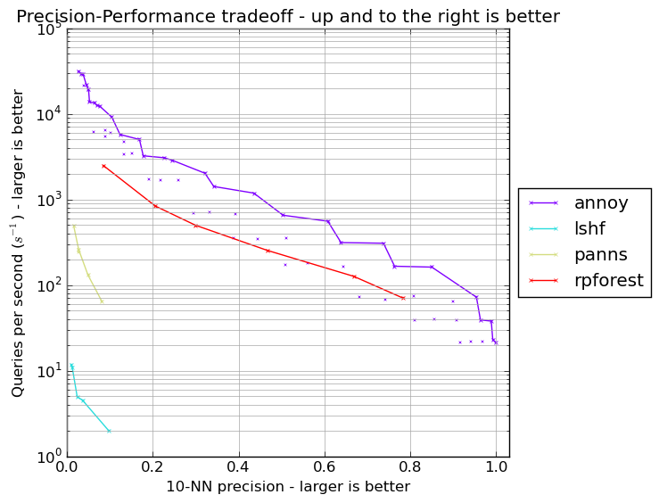

# rpforest

<center></center>

rpforest is a Python library for approximate nearest neighbours search: finding points in a high-dimensional space that are close to a given query point in a fast but approximate manner.

rpforest differs from alternative ANN packages such as [annoy](https://github.com/spotify/annoy) by not requiring the storage of all the vectors indexed in the model. Used in this way, rpforest serves to produce a list of candidate ANNs for use by a further service where point vectors are stored (for example, a relational database).

## How it works

It works by building a forest of N binary random projection trees.

In each tree, the set of training points is recursively partitioned into smaller and smaller subsets until a leaf node of at most M points is reached. Each parition is based on the cosine of the angle the points make with a randomly drawn hyperplane: points whose angle is smaller than the median angle fall in the left partition, and the remaining points fall in the right partition.

The resulting tree has predictable leaf size (no larger than M) and is approximately balanced because of median splits, leading to consistent tree traversal times.

Querying the model is accomplished by traversing each tree to the query point's leaf node to retrieve ANN candidates from that tree, then merging them and sorting by distance to the query point.

## Installation

1. Clone the rpforest repository: `git clone git@github.com:lyst/rpforest.git`
2. Install it using pip: `cd rpforest && pip install .`

## Usage

### Fitting
Model fitting is straightforward:
```python
from rpforest import RPForest

model = RPForest(leaf_size=50, no_trees=10)
model.fit(X)
```
The speed-precision tradeoff is governed by the `leaf_size` and `no_trees` parameters. Increasing `leaf_size` leads the model to produce shallower trees with larger leaf nodes; increasing `no_trees` fits more trees.

### In-memory queries
Where the entire set of points can be kept in memory, rpforest supports in-memory ANN queries. After fitting, ANNs can be obtained by calling:
```python
nns = model.query(x_query, 10)
```
Return nearest neighbours for vector x by first retrieving candidate NNs from x's leaf nodes, then merging them and sorting by cosine similarity with x. At most no_trees * leaf_size NNs will can be returned.

### Candidate queries
rpforest can support indexing and candidate ANN queries on datasets larger than would fit in available memory. This is accomplished by first fitting the model on a subset of the data, then indexing a larger set of data into the fitted model:
```python
from rpforest import RPForest

model = RPForest(leaf_size=50, no_trees=10)
model.fit(X_train)

model.clear()  # Deletes X_train vectors

for point_id, x in get_x_vectors():
     model.index(point_id, x)

nns = model.get_candidates(x_query, 10)
```

### Model persistence
Model persistence is achieved simply by pickling and unpickling.
```python
model = pickle.loads(pickle.dumps(model))
```

### Performance
[Erik Bernhardsson](https://twitter.com/fulhack), the author of annoy, maintains an ANN [performance shootout](https://github.com/erikbern/ann-benchmarks) repository, comparing a number of Python ANN packages.

On the GloVe cosine distance benchmark, rpforest is not as fast as  highly optimised C and C++ packages like FLANN and annoy. However, it far outerpforms scikit-learn's [LSHForest](http://scikit-learn.org/stable/modules/generated/sklearn.neighbors.LSHForest.html) and [panns](https://github.com/ryanrhymes/panns).

<center></center>
